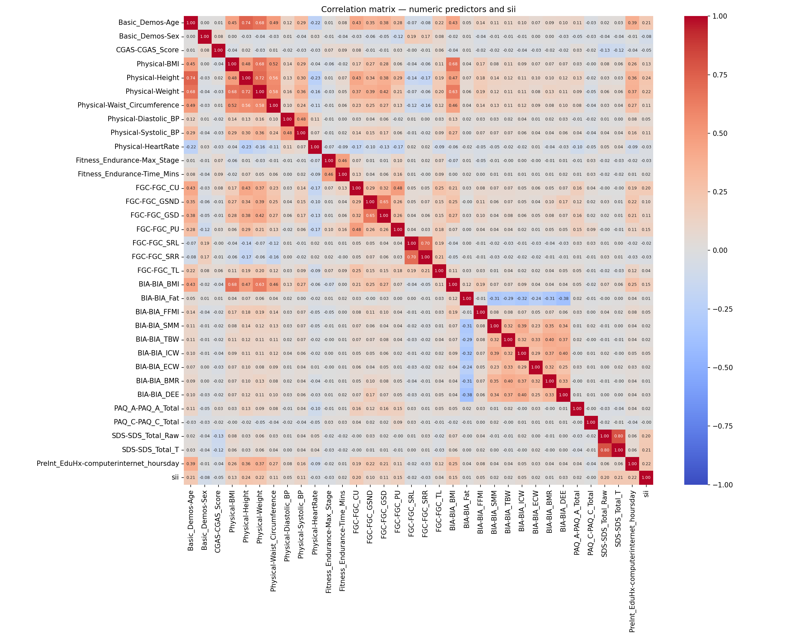
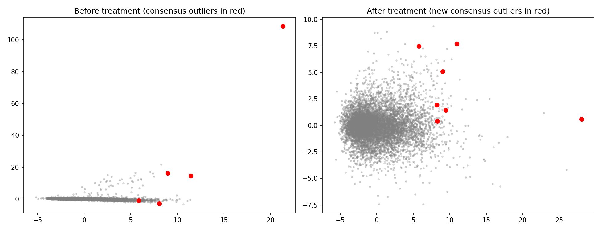
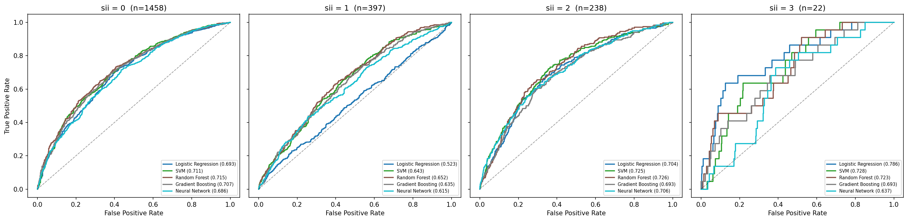
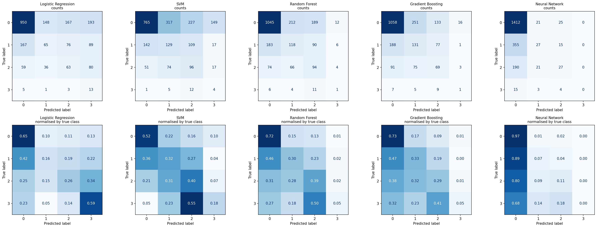
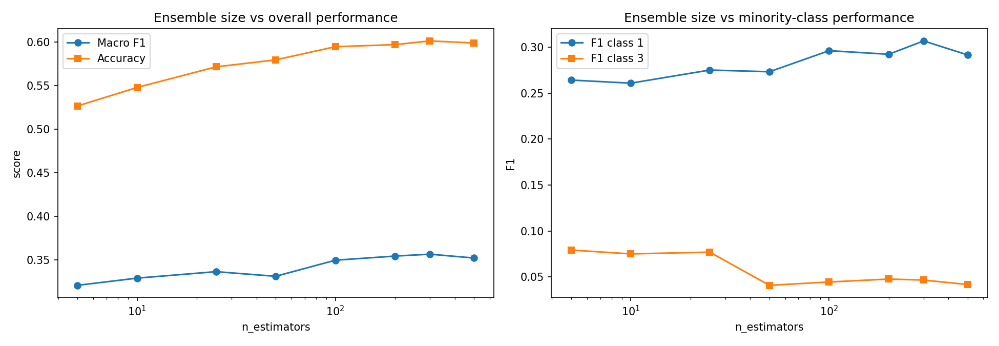
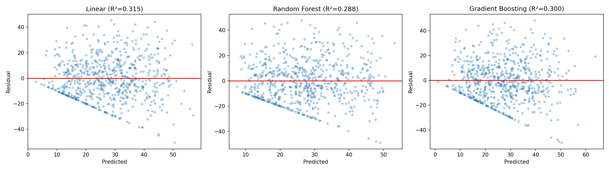
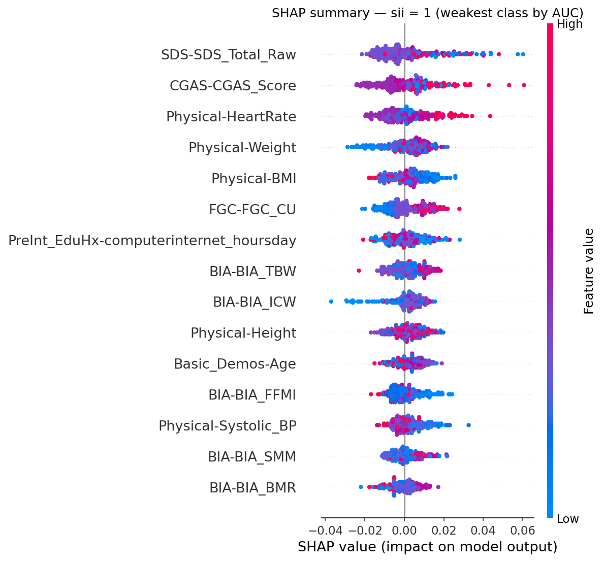
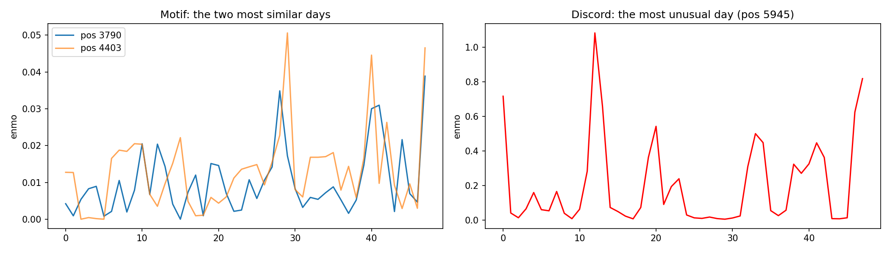
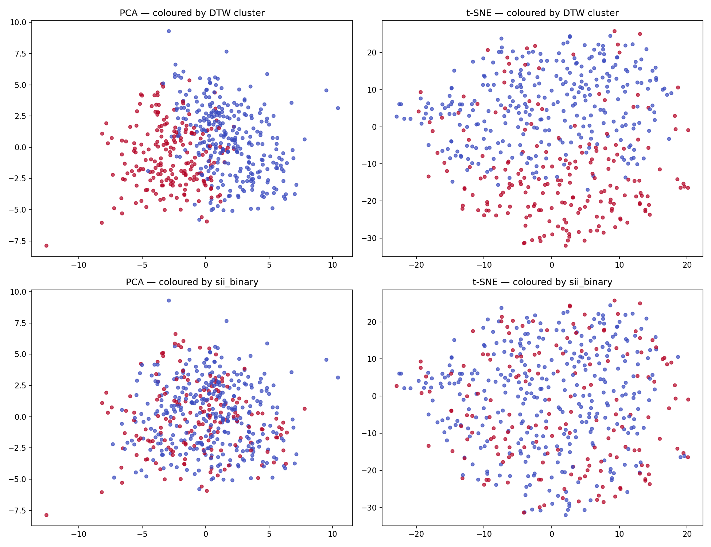
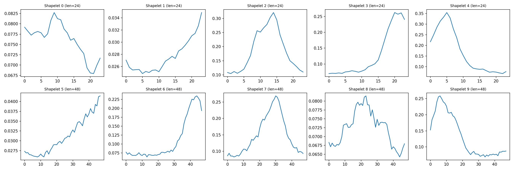

# Child Internet Use — Data Mining Analysis

Predicting problematic internet use in children and adolescents from physical
activity, fitness and clinical assessment data.

**Data Mining 2 project — University of Pisa, a.a. 2025/2026**
Tetiana Marinoshenko

---

## The question

Can a child's level of problematic internet use be inferred from their physical
activity and fitness measurements?

The project works with two related datasets from the Child Mind Institute: a
tabular record of 8,460 children across ten clinical instruments, and 4,437
windows of wrist-worn accelerometer data from a subset of 494 of them. The
target is the Severity Impairment Index (`sii`), a four-level clinical measure
of problematic internet use, binarised for the time-series analysis.

---

## What the analysis found

**Physical measurements explain about a quarter of the variation in internet
addiction scores, and no choice of model recovers more.** Five classification
algorithms converge on macro F1 between 0.28 and 0.35; three regression
approaches converge on cross-validated R² ≈ 0.25 with overlapping confidence
intervals. Feature importance is distributed evenly across all 32 predictors
with none exceeding 6%.

**In the accelerometer data the signal is activity level, not activity
pattern.** Mean activity alone achieves ROC-AUC 0.621; motif analysis,
shape-based clustering, DTW, shapelets and ROCKET add nothing beyond it. Only
Euclidean KNN exceeds the single-number baseline, and by 0.023 AUC.

**Data quality problems changed the results rather than merely tidying them.**
A decimal-point entry error in the clinical functioning scale, physiologically
impossible values in bioelectric impedance measurements, and a target variable
that turned out to be near-deterministically derived from an excluded feature
each altered what the models could legitimately be asked to do.

---

## Structure

```
notebooks/
├── DM2_00a_data_understanding_tabular.ipynb     Module 0 — tabular data
├── DM2_00b_data_understanding_timeseries.ipynb  Module 0 — accelerometer data
├── DM2_01_preprocessing.ipynb                   Module 1 — outliers, imbalance
├── DM2_02_advanced_ml_xai.ipynb                 Module 2 — classification, regression, SHAP
├── DM2_03_time_series.ipynb                     Module 3 — motifs, clustering, classification
└── DM2_04_feature_fusion.ipynb                  Additional — combining both datasets

reports/                                          Figures referenced in the report
```

---

## Module 0 — Data understanding and preparation

Two datasets, examined separately.

**Tabular.** Missingness follows two distinct structures across the ten
instruments: block-wise, where an instrument is administered in full or not at
all (Sleep Disturbance Scale, missingness correlation exactly 1.00), and
scattered, where individual readings fail independently within an administered
session (bioelectric impedance, correlation 0.17–0.21). The distinction
determines how each can be imputed.

Three corrections were applied. Sixteen records carried a clinical functioning
score above the scale maximum of 100; dividing by ten placed all sixteen back
inside the valid range, identifying a decimal-point entry error rather than a
sentinel. Physiologically impossible zeros in four physical measurements were
set to missing. And 169 body-fat percentages outside [0, 100] — including
values as extreme as −8,745% — were removed, which raised that variable's
correlation with body mass index from 0.116 to **0.732** and with the target
from 0.014 to 0.167.

**The target is not independent of the excluded features.** `sii` is fully
observed for all 8,460 children, yet `PCIAT_Total` — the questionnaire score it
derives from — is missing for 5,746 of them. Where both are present, standard
clinical thresholds reproduce `sii` exactly in 2,708 of 2,714 cases. The PCIAT
fields are therefore excluded from every predictive task, since including them
would recover the discretisation rule rather than model the phenomenon.

**Time series.** The 4,437 windows are not one per child: 241 children
contribute a single window while 167 contribute more than ten, together
accounting for 85% of the data. All splitting and statistical testing is
grouped by child accordingly — a `quarter` effect that appeared highly
significant at window level (χ² = 66.9, p < 0.0001) vanished when tested on
476 independent children (p = 0.178).



---

## Module 1 — Advanced preprocessing

**Outliers.** Three detectors from different families — Isolation Forest,
Local Outlier Factor and Elliptic Envelope — each flagged the top 1%, and
agreed almost not at all: 225 distinct records flagged, only five by two
methods, one by all three. The disagreement is the finding rather than a
problem, since each formalises a different definition of anomaly.

One flagged record proved instructive: its raw data showed most measurements
genuinely missing and the remainder entirely normal. The anomaly had been
created by the median imputation applied before detection. Imputation performed
prior to outlier detection can manufacture anomalies as well as mask them.



**Imbalanced learning.** A binary task (problematic against non-problematic,
31%/69%) solved with a Decision Tree under random undersampling and SMOTE. Both
raised minority recall substantially (0.31 → 0.55 and 0.46) at the cost of
false positives. But ROC-AUC *fell* slightly under both, indicating the
techniques shifted the decision threshold without improving the ranking — and
threshold calibration on the untouched baseline reproduced the same recall at
higher precision, retaining all training data.

---

## Module 2 — Advanced classification, regression and explainability

Five algorithms on the four-class task, tuned by macro F1 because accuracy
selects models that ignore three of the four classes.

| Model | Accuracy | Macro F1 | Macro AUC |
|---|---|---|---|
| **Random Forest** | 0.595 | **0.350** | **0.704** |
| Gradient Boosting | 0.595 | 0.342 | 0.682 |
| SVM (RBF) | 0.470 | 0.308 | 0.702 |
| Logistic Regression | 0.516 | 0.304 | 0.676 |
| Neural Network | **0.693** | 0.278 | 0.661 |

The accuracy and macro F1 rankings are almost exactly inverted. The Neural
Network's leading accuracy is marginally above the 0.689 obtainable by always
predicting the majority class — it recalls 96.8% of that class and never
predicts the rarest one at all.

Gradient Boosting provided a controlled demonstration of the effect of class
weighting: `HistGradientBoostingClassifier` has no `class_weight` parameter, and
refitting the identical configuration with balanced `sample_weight` raised macro
F1 from 0.313 to 0.342, holding everything else constant.




**Ensemble size cuts both ways.** Varying `n_estimators` from 5 to 500 improves
the second-largest class by 16% and degrades the rarest by 41%. With 66 training
examples spread across 32 features, a tree that happens to isolate some of them
carries weight in a five-tree vote and is drowned out in a five-hundred-tree
one.



**Regression** on the continuous questionnaire score, which retains signal the
four-class discretisation destroys — feature correlations reach 0.409 against a
maximum of 0.236 for the same features against `sii`. Neither non-linear
approach improved on linear regression once evaluated by cross-validation
rather than a single split.



**Random Forest feature importance is remarkably flat**: the top feature
accounts for 6.0% and the eighth for 4.0%, with only 2 of 32 features below 1%.
For comparison, the DM1 project found three features accounting for 82% of
total importance. There is no dominant predictor to find, which is precisely the
regime where no algorithm can substantially outperform any other — as the
five-way convergence on macro F1 between 0.278 and 0.350 demonstrates.

**SHAP** revealed one substantial disagreement with the model's built-in
importances. Self-reported daily screen time — conceptually the feature closest
to the target — ranks third by SHAP and seventeenth by impurity importance,
because impurity importance favours features with many possible split points
and this variable takes only four discrete values.



---

## Module 3 — Time series

Mean activity per window establishes the baseline at child-level ROC-AUC 0.621,
an effect that survives aggregation to 476 independent children
(Cliff's δ = 0.243).

**Motifs.** The choice of normalisation determines what a motif means. The
non-normalised matrix profile pairs the two quietest days in a series, since
Euclidean distance between near-zero sequences is small regardless of shape.
The z-normalised profile pairs two days at different activity levels but with
near-identical shape — a sharp morning burst followed by prolonged quiet.
Neither distinguishes the classes.



**Clustering** separates the two effects directly. Two algorithms were applied
— K-Means and Ward agglomerative clustering — across three data
representations:

| Algorithm | Data | Silhouette | ARI vs target |
|---|---|---|---|
| Ward | raw (level + shape) | 0.3586 | −0.025 |
| K-Means | raw (level + shape) | 0.2525 | −0.026 |
| K-Means + DTW | z-normalised (shape only) | 0.0848 | 0.021 |
| K-Means | z-normalised (shape only) | 0.0363 | — |

Ward scores highest but the score is misleading: it isolates 124 windows with
mean activity 0.0953 against 0.0500 for the rest, which looks like a distinct
high-activity population until the ranges are checked — 366 of the 876
low-cluster windows exceed the high cluster's minimum. Ward cut the upper tail
off a continuum, and the high silhouette reflects the asymmetry of a small tight
group against a large dispersed one.

Removing the activity level through z-normalisation collapses the silhouette
sevenfold. DTW recovers part of the shape-based structure by allowing the time
axis to warp, but it remains three times weaker than level-based structure.
Adjusted Rand Index against the target is near zero for both algorithms: the
partition into active and inactive children is real, and it is not the partition
into problematic and non-problematic.



**Classification.** Only Euclidean KNN beat the baseline, by 0.023 AUC. DTW
performed worse than Euclidean distance here, reversing its clustering
advantage — warping dissolves the activity-level differences that carry the
signal. ROCKET produced the worst result of any method (child AUC 0.507) with
a training AUC of 1.000: 20,000 random features on 686 instances admit a
perfect training separation regardless of whether any relates to the target.

The learned shapelets confirm the module's finding independently. They divide
into two amplitude bands differing four- to fivefold, and the same shapes
recur in both — the supervised method discriminates by magnitude, not by form.



---

## Data

The analysis uses the Child Mind Institute *Problematic Internet Use* dataset,
originally released for a Kaggle competition:
https://www.kaggle.com/competitions/child-mind-institute-problematic-internet-use/data

**The data files are not included in this repository.** The course used a
modified version of the original — some missing values were altered and
synthetic samples added — so downloading the Kaggle release will not reproduce
these results exactly. The time-series data was additionally aggregated to
30-minute intervals and its target binarised before distribution.

---

## Running the notebooks

Written for Google Colab, which provides most dependencies. The specialised
libraries are installed inline where first used:

```
imbalanced-learn    Module 1 — resampling
shap                Module 2 — explainability
stumpy              Module 3 — matrix profile
tslearn             Module 3 — DTW clustering, shapelets
sktime              Module 3 — ROCKET
```

Each notebook begins by mounting Google Drive and setting two paths:

```python
DATA = '/content/drive/MyDrive/2_PROJECTS/DM2_25_26/data'
REPORTS = '/content/drive/MyDrive/2_PROJECTS/DM2_25_26/reports'
```

These point to the author's own Drive and will not resolve elsewhere. To run
the notebooks on another machine, place the dataset files in a directory of
your choice and change both variables accordingly. `DATA` must contain
`cmi_internet.csv`, `data_dictionary.csv` and `CMI_timeseries_dataset.pkl.gz`;
`REPORTS` is the directory figures are written to and can be any writable path.

Notebooks are intended to be run in order — Module 1 reproduces the Module 0
corrections at the top rather than reading a saved intermediate file, so each
is self-contained given the raw data.
